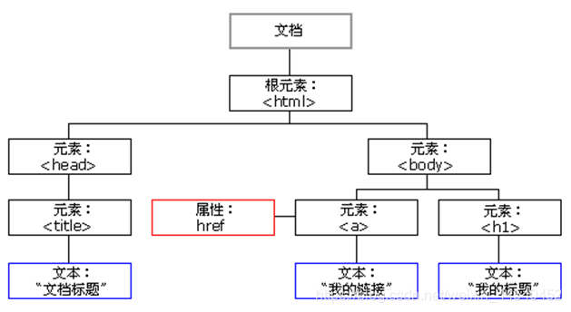
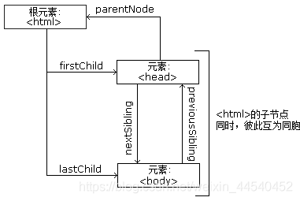

# 1. HTTP 基本原理

## 1.1 URI 和 URL

- **URI**：统一资源标识符

  - **URL**：统一资源定位符

    - ```python
      http://localhost:8080/Study/test.jsp
      ```

    - 指定了访问资源的唯一方式（访问协议、访问路径和资源名称）

  - **URN**：统一资源名称

    - ```python
      urn:id:123456
      ```

    - 只为资源命名，但不指定如何定位

- URL的基本组成格式

  ```python
  scheme://[username:password@]hostname[:port][/path][;parameters][?query][#fragment]
  ```

  - **scheme（protocol）**：协议

    - 常用协议：hrrp、https、ftp等

  - **username、password**：用户名、密码

    - 某些情况下 URL 需要提供用户名和密码才能访问

  - **hostname**：主机地址

    - 可以是域名或 IP 地址

  - **port**：端口

    - ```python
      http://localhost:8080
      ```

    - 服务器设定的端口

  - **path**：路径

    - 网络资源在服务器中的指定地址

  - **parameters**：参数

    - 用来指定访问某个资源时的附加信息

  - **query**：查询

    - 用来查询某类资源
    - 如有多个查询，则用 & 隔开

  - **fragment**：片段

    - 对资源描述的部分补充
    - 两个主要应用
      - 单页面路由：Vue、React 都可以借助它来做路由管理
      - HTML 锚点：控制一个页面打开时自动下滑滚动到某个特定的位置


## 1.2 HTTP 和 HTTPS

- **HTTP**：超文本传输协议
  - 把超文本数据从网络传输到本地路由器
  - 能够保证高效而准确地传输超文本文档
- **HTTPS**：以安全为目标的 HTTP 通道
  - 在 HTTP 下加入 SSL 层
  - SSL 的主要作用
    - 建立一个信息安全通道，保证数据传输的安全性
    - 确认网站的真实性


## 1.3 请求

### 1.3.1 请求方法

- 用于标识请求客户请求服务端的方式
- 常见的请求方法：
  - **GET**：在浏览器中直接输入 URL 并回车
    - 请求的参数会直接包含到 URL 里
  - **POST**：大多在提交表单时发起
    - 数据通常以表单的形式传输，而不会体现在 URL 中

- GET 和 POST 请求方法的区别
  - GET
    - 参数包含在 URL 中，数据可以在 URL 中看到
    - 提交的数据最多只有1MB
  - POST
    - URL 不包含参数数据，数据都是通过表单形式传输，会包含在请求体中
    - 对提交的数据没有大小限制


### 1.3.2 请求的网址

- 唯一确定客户端向请求的资源


### 1.3.3 请求头

- 用来说明服务器要使用的附加信息
- 常用的请求头信息
  - Accept：请求报头域
    - 用于指定客户端可接受哪些类型的信息
  - Accept-Language：
    - 用于指定客户端可接受的语言类型
  - Accept-Encoding：
    - 用于指定客户端可接受的内容编码
  - Host：
    - 用于指定请求资源的主机 IP 和端口号
    - 内容为请求 URL 的原始服务器或网关的位置
  - Cookie：
    - 网站为了辨别用户，进行会话跟踪而存储在用户本地的数据
    - 主要功能为维持当前访问会话
      - 自动登录
  - Referer：
    - 用于标识请求是哪个页面发过来的
  - User-Agent：
    - 一个特殊的字符串头
    - 使服务器识别客户端使用的操作系统及版本、浏览器及版本等信息
  - Content-Type：互联网媒体类型（MIME 类型）
    - 在 HTTP 协议消息头中
    - 用来标识具体请求中的媒体类型信息
      - text/html：HTML 格式
      - image/gif：GIF 图片
      - application/json：JSON 类型


### 1.3.4 请求体

- 一般承载的内容是 POST 请求中的表单数据
- 对于 GET 请求，请求体为空


## 1.4 响应

### 1.4.1 响应状态码

- 表示服务器的响应状态
- 常见的状态码
  - 200：服务器正常响应
  - 404：页面未找到
  - 500：服务器内部发生错误


### 1.4.2 响应头

- 包含了服务器对请求的应答信息
- 常用的响应头信息
  - Date：
    - 用于标识响应产生的时间
  - Last-Modified：
    - 用于指定资源的最后修改时间
  - Content-Encoding：
    - 用于指定响应内容的编码
  - Server：
    - 包含服务器的信息
      - 名称、版本号等
  - Content-Type：文档类型
    - 指定返回的数据类型
  - Set-Cookie：设置 Cookie
    - 用于告诉浏览器需要将此内容放在 Cookie 中，下次请求时将 Cookie 携带上
  - Expires：
    - 用于指定响应的过期时间
    - 让代理服务器或浏览器将加载的内容更新到缓存中
    - 当再次访问相同的内容时，就可以直接从缓存中加载


### 1.4.3 响应体

- 响应的正文数据都存在于响应体中


# 2. Web 网页基础

## 2.1 网页的组成

### 2.1.1 HTML

- 超文本标记语言
- 网页的基础架构


### 2.1.2 CSS

- 层叠样式表
  - 层叠：
    - 当 HTML 中引用了多个样式文件，并且样式发生冲突时，浏览器能够按照层叠顺序处理这些样式
  - 样式：
    - 网页中的文字大小、颜色、元素间距、排列等格式


### 2.1.3 JavaScript

- 脚本语言
- 实现了一种实时、动态、交互的页面功能


## 2.2 网页的结构

- 一个网页的标准形式是 html 标签内嵌套 head 标签和 body 标签
  - head 标签内定义网页的配置和引用
  - body 标签内定义网页的正文


## 2.3 节点树及节点间的关系

- HTML节点树：HTML DOM 树

- 整个文档是一个文档节点
- 每个 HTML 元素是元素节点
- HTML 元素内的文本是文本节点
- 每个 HTML 属性是属性节点
- 注释是注释节点



- 节点树中的节点彼此拥有层级关系

- 常用父（parent）、子（child）和兄弟（sibling）等术语用于描述这些关系
  - 父节点拥有子节点
  - 同级的子节点被称为兄弟节点

- 在节点树中，顶端节点被称为根（root）

- 每个节点都有父节点、除了根（它没有父节点）

- 一个节点可拥有任意数量的子节点或兄弟节点




## 2.4 选择器

- 在 CSS 中，使用 CSS 选择器来定位节点


# 3. 爬虫的基本原理

## 3.1 爬虫概述

### 3.1.1 获取网页

- 获取网页的源代码


### 3.1.2 提取信息

- 分析源代码，从中提取所需数据


### 3.1.3 保存数据

- 将提取到的数据保存到某处以便后续使用


### 3.1.4 自动化程序

- 代替人来完成上述操作


# 4. Session 和 Cookie

## 4.1 静态网页和动态网页

- 静态网页
  - 网页的内容由 HTML 代码编写，文字、图片等内容均通过写好的 HTML 代码来指定
- 动态网页
  - 动态解析 URL 中参数的变化，关联数据库并动态呈现不同的页面内容


## 4.2 无状态 HTTP

- HTTP 协议对事务的处理没有记忆能力
- 服务器不知道客户端处于什么状态


## 4.3 Session

- 会话
- 有始有终的一系列动作、信息
- Session 对象用来存储特定用户 Session 所需的属性及配置信息
- 当用户进行页面跳转时，存储在 Session 中的变量不会丢失
- 如果没有 Session ，Web 服务器会自动创建一个 Session 对象
- Session 过期后，服务器将终止该 Session


## 4.4 Cookie

### 4.4.1 Session 维持

- 客户端第一次请求服务器时，服务器会返回一个响应头中带有 Set-Cookie 字段的响应给客户端，这个字段用来标记用户
- 当下一次请求相同的网站时，把保存的 Cookie 放到请求头中一起提交给服务器
- Cookie 中携带着 SessionID 相关信息，服务器通过检查 Cookie 即可找到对应的 Session，进而通过判断 Session 辨认用户状态


### 4.4.2 属性结构

- Name：
  - Cookie 的名称

- Value：
  - Cookie 的值 

- Domain：
  - 指定可以访问该 Cookie 的域名

- Path：
  - Cookie 的使用路径
- Max-Age：
  - Cookie 失效的时间

- Size 字段：
  - Cookie 的大小
- HTTP 字段：
  - Cookie 的 httponly 属性
  - 若此属性为true，则只有在 HTTP Headers 中才会带有此 Cookie 信息，而不能通过脚本document.cookie来访问该 Cookie

- Secure
  - 是否仅允许使用安全协议传输 Cookie


### 4.4.3 会话 Cookie 和持久 Cookie

- 会话 Cookie
  - 把 Cookie 放在浏览器内存中，关闭浏览器后，Cookie 即失效
- 持久 Cookie
  - 把 Cookie 保存到客户端的硬盘中，下次还可以继续使用


